## 基于Java+Springboot+thymeleaf的物业管理系统(源代码+数据库)129

## 一、系统介绍
本系统分为管理员、小区管理员、用户三种角色

### 1、用户：
- 登录、车位费查询、物业费查询、公告通知、评论、投诉服务、报修服务、个人中心、密码修改
### 2、小区管理员：
- 车位费管理、物业收费管理(收费项目管理、抄表管理、缴费记录管理)、投诉管理、报修管理、维修管理、密码修改
### 3、超级管理员：
- 小区管理员所有功能、住户管理、楼宇管理、房屋管理(出售、出租)、车位管理、员工管理、统计分析、公告管理、公告评论管理、投诉信息管理、保修信息管理

## 二、所用技术

后端技术栈：

- Springboot
- Mybatis
- Mysql
- Maven

前端技术栈：

- thymeleaf 
- html
- ajax 
- css
- javascript
- layui

## 三、环境介绍

基础环境 :IDEA/eclipse,navicat, JDK1.8, Mysql5.7及以上,Maven3.6

所有项目以及源代码本人均调试运行无问题 可支持远程调试运行

## 四、页面截图
### 1、用户

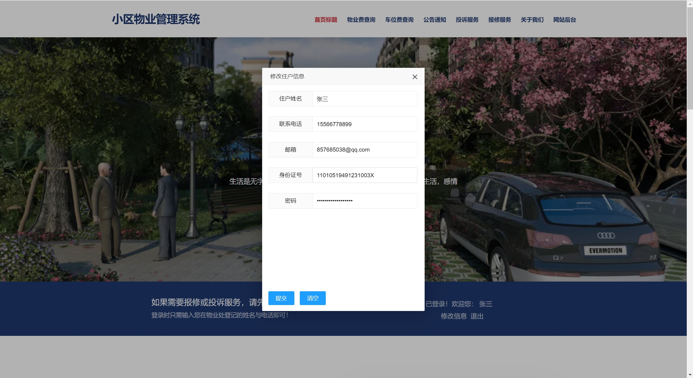

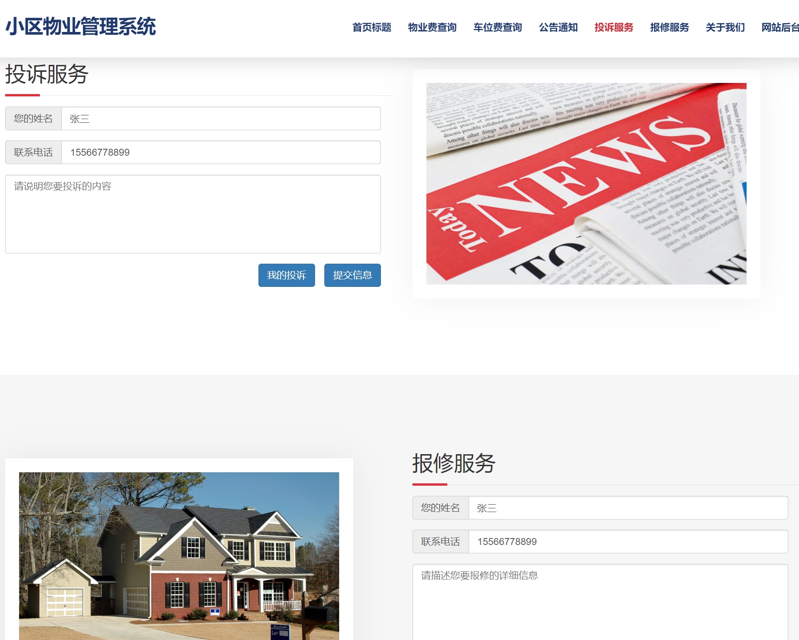
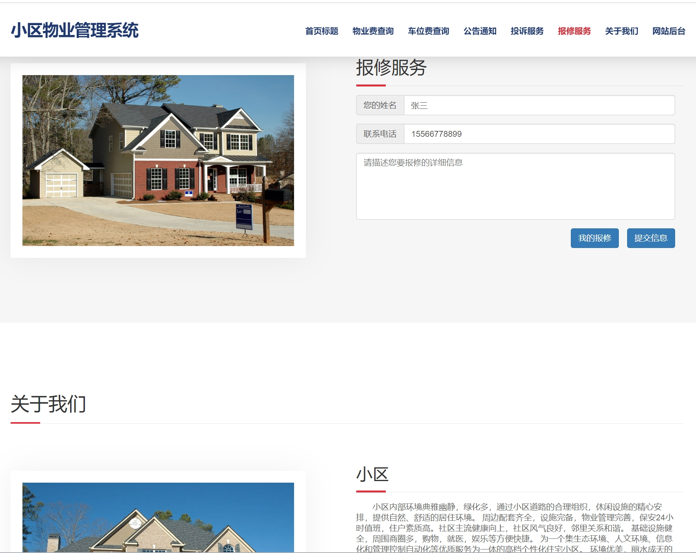
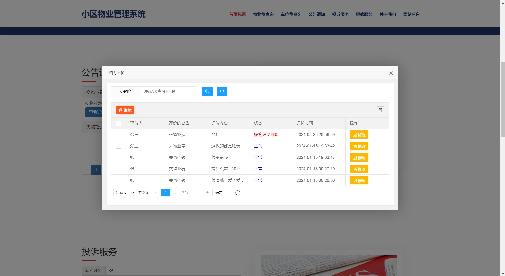
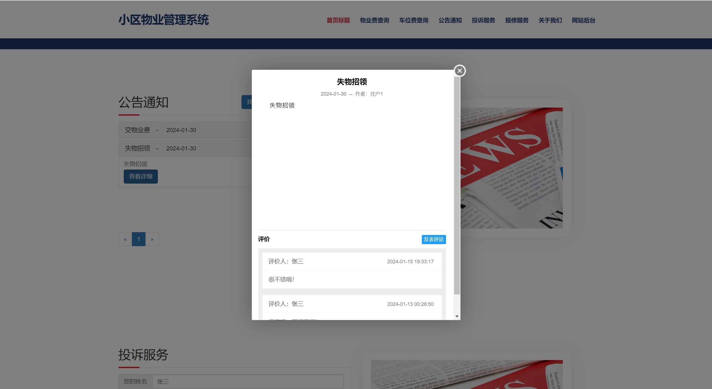

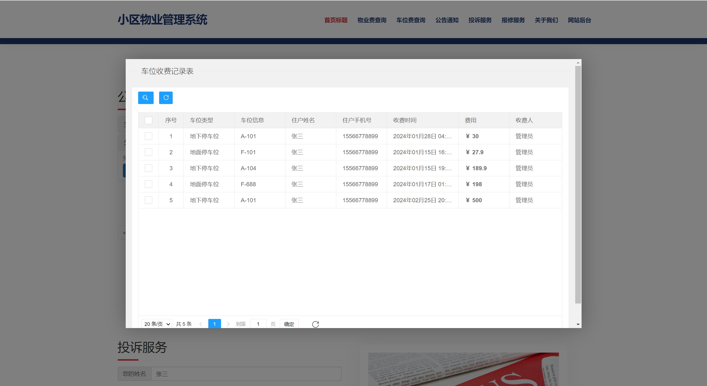
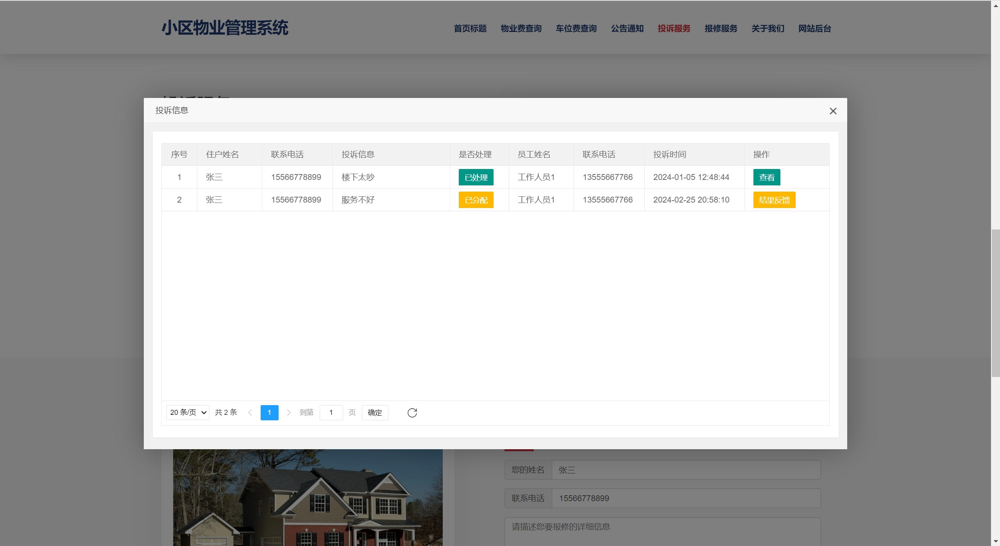
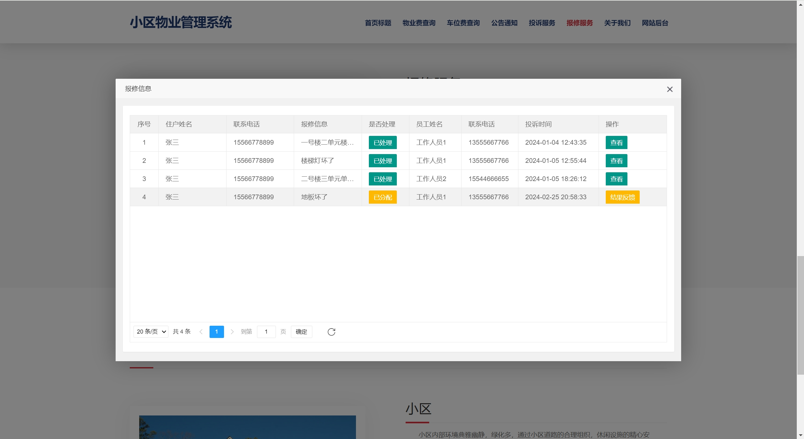

### 2、社区管理员：

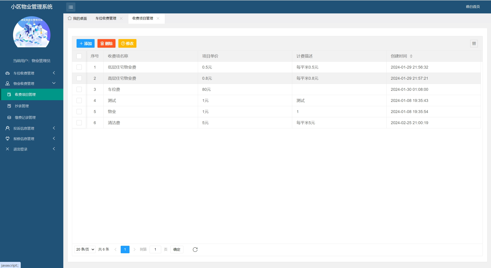
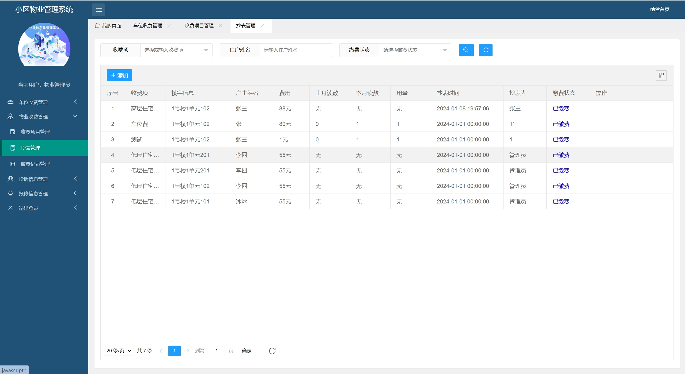

### 3、超级管理员：
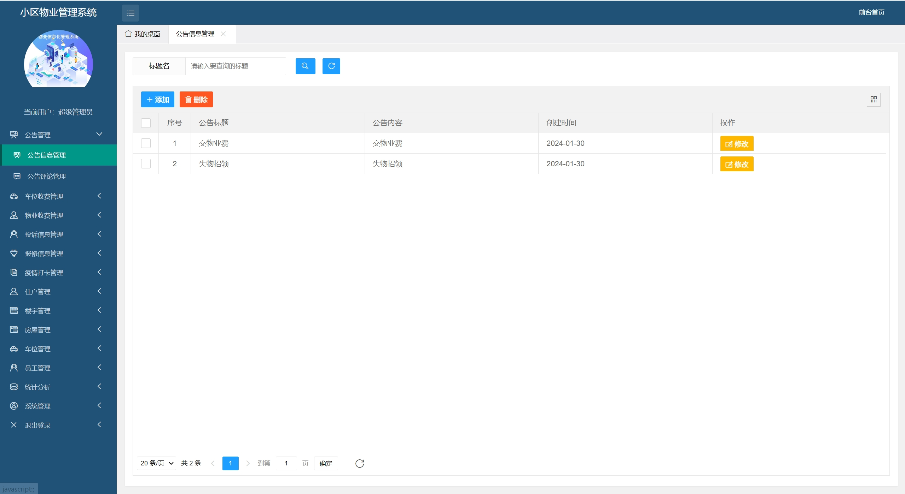
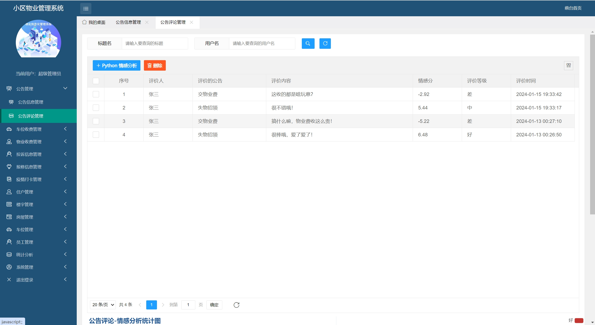

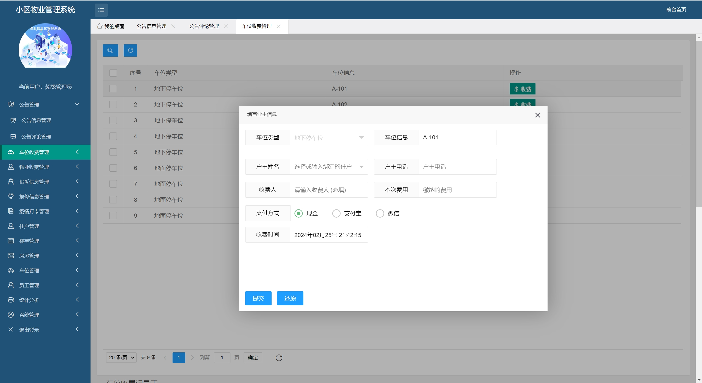

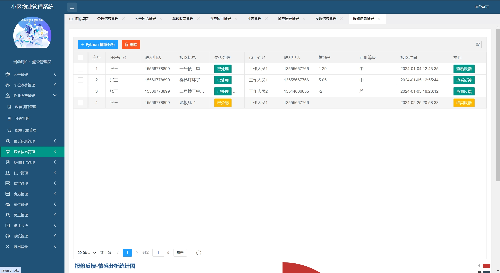
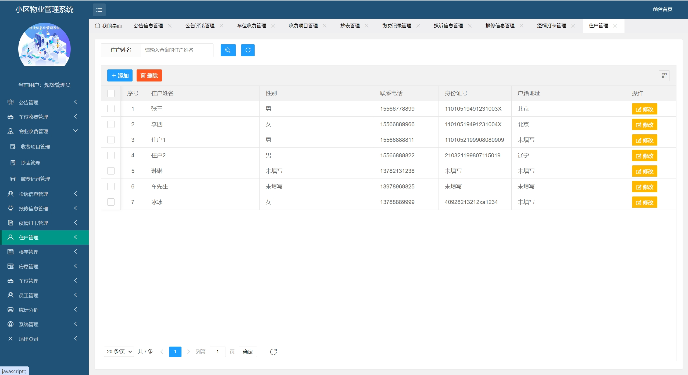

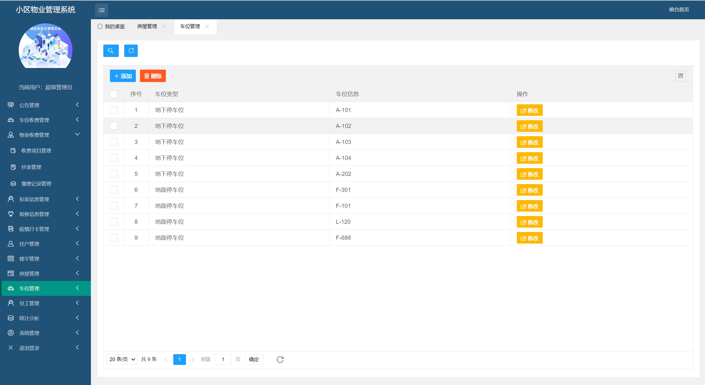

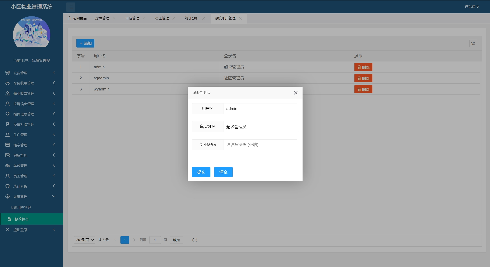

## 五、浏览地址

前台访问地址：http://localhost:2281/housing/index
- 用户账号/密码：张三/123456

后台访问地址：http://localhost:2281/housing/system/toLoginPage
- 小区管理员账号/密码：wyadmin/123456
- 超级管理员账号/密码：admin/123456

## 六、部署教程
1. 使用Navicat或者其它工具，在mysql中创建对应名称的数据库，并执行项目的sql文件
2. 使用IDEA/Eclipse导入community_estate_manage项目，若为maven项目请选择maven，等待依赖下载完成
3. 进入src/main/resources修改application.yml里面的数据库配置
4. src/main/java/com/project/property/PropertyAdminApplication.java启动后端项目

